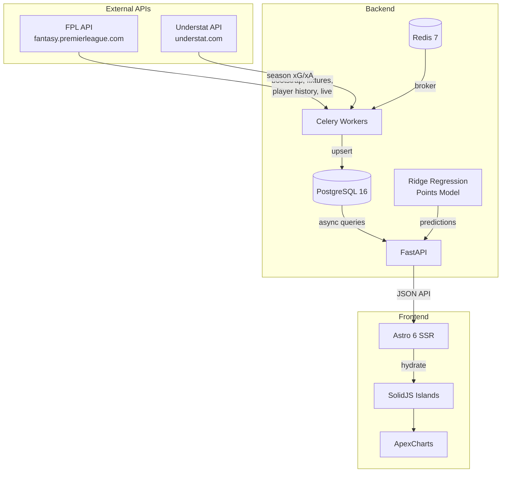

# FPL Analytics

A Fantasy Premier League analytics platform that helps FPL managers make better decisions — who to transfer in, who to captain, when to play chips, and how many points players are likely to score.

---

## What does it do?

FPL Analytics collects data from two sources, analyses it, and presents actionable advice through a web dashboard.

### The data sources

**1. Official FPL API** — The same data that powers the Fantasy Premier League website. This includes every player's points history, fixture schedule, price changes, ownership percentages, and live match scores.

**2. Understat** — An independent football statistics site that tracks Expected Goals (xG) and Expected Assists (xA). These measure the quality of chances a player gets, not just whether they scored. A player with high xG but low goals is getting into good positions and is likely to start scoring soon.

### How the data flows

```
FPL API ──────┐
              ├──> Background Workers ──> Database ──> API Server ──> Website
Understat ────┘
```

Here's what happens step by step:

**Step 1: Data collection** — Background workers run on a schedule to pull fresh data. They fetch all 825 players, 380 fixtures, and thousands of per-gameweek stat rows. Understat data is matched to FPL players using fuzzy name matching (because the two sites don't use the same player IDs).

**Step 2: Processing** — The raw data is cleaned and stored in a database with 8 tables. A "form cache" is computed that summarises each player's recent performance over rolling windows of 4, 6, and 10 gameweeks. This is what powers the "form" numbers you see throughout the app.

**Step 3: Predictions** — A machine learning model (Ridge regression) is trained on all historical gameweek data from the season. It learns patterns like "players with high xG/90, easy fixtures, and home advantage tend to score more points." It then predicts how many points each player will score over the next 5 gameweeks.

**Step 4: Decision support** — The API combines form data, predictions, fixture difficulty, and ownership trends into ranked recommendations: who to buy, who to captain, when to use your chips.

**Step 5: The website** — A server-rendered frontend displays everything in a dark-themed dashboard with interactive charts and live-updating scores.

---

## What's on each page?

### Dashboard (`/`)
The home page. Shows a countdown to the next deadline, the captain pick of the week, top transfer targets, trending players (most transferred in), and low-ownership differentials. A stadium hero image sets the atmosphere.

### Live Scores (`/live`)
During an active gameweek, this page polls the FPL API every 60 seconds and shows live fixture scores alongside a table of the top-scoring players. The polling automatically starts when the first match kicks off and stops once the last match finishes. Outside of active gameweeks, it shows the most recent results.

### Players (`/players`)
A searchable, filterable, sortable table of all Premier League players. You can filter by position (GK, DEF, MID, FWD) and sort by form, price, xGI/90, or points per game. Click any player to see their full profile.

### Player Detail (`/players/{id}`)
Everything about one player. Includes:
- **Form stats** — Points, points per game, minutes played %, BPS average (last 6 gameweeks)
- **Season xG data** — Expected Goals vs actual goals, Expected Assists vs actual assists (interactive bar chart)
- **Points chart** — Interactive area chart showing points scored each gameweek, with hauls (10+ points) highlighted
- **Price history** — A sparkline showing how the player's price has changed over the season
- **Upcoming fixtures** — Colour-coded by difficulty (green = easy, red = hard)
- **Full gameweek history** — Every stat from every gameweek in a table

### Fixtures (`/fixtures`)
Browse fixtures one gameweek at a time with forward/back navigation. Shows team badges, fixture difficulty ratings, kickoff times, and scores for completed matches.

### Transfer Planner (`/decisions/buy-sell`)
Ranks players by a composite score: 40% xGI/90 (attacking quality), 30% points per million (value), 30% recent form, minus a penalty for tough upcoming fixtures. Also shows predicted points from the ML model. The subtitle explains: "Based on last 6 GWs form + upcoming fixtures."

### Captain Picker (`/decisions/captain`)
Ranks captain options by: 40% ceiling score (highest single-GW haul in last 10 weeks), 30% form, 20% BPS average, plus bonuses for home fixtures and double gameweeks. Shows penalty taker and set piece taker flags.

### Chip Advisor (`/decisions/chips`)
A calendar view of upcoming gameweeks highlighting Double Gameweeks (DGW) and Blank Gameweeks (BGW). Recommends when to use Bench Boost, Triple Captain, or Free Hit.

### Predictions (`/predictions`)
Shows predicted points for every player across the next 5 gameweeks (or fewer if the season is ending). A methodology section explains exactly how predictions work — which 8 features the model uses and what each one means. The table breaks down predictions per gameweek so you can see which players peak when.

---

## How the prediction model works

The model is a Ridge regression trained on 22,000+ historical player-gameweek data points from the current season. For each player and each upcoming fixture, it builds a feature vector from 8 inputs:

| Feature | What it measures |
|---------|-----------------|
| **xGI/90** | Expected goal involvements per 90 minutes (from Understat) — attacking quality |
| **Minutes %** | Percentage of available minutes played in last 6 GWs — likelihood of starting |
| **FDR** | Fixture Difficulty Rating (1-5) — how tough the opponent is |
| **Home/Away** | Whether the player's team is at home — home advantage matters |
| **BPS avg** | Average Bonus Point System score — all-round match contribution |
| **DGW flag** | Whether this is a double gameweek — two matches means roughly double the points |
| **Set piece taker** | Whether the player takes penalties or set pieces — extra scoring opportunities |
| **Season xGI** | Total expected goal involvements this season — overall quality level |

The model predicts points per fixture, then sums across all fixtures in the horizon (handling double gameweeks naturally). Players are ranked by total predicted points.

---

## How the ranking systems work

### Transfer ranking
```
Score = (xGI/90 x 40%) + (Points per Million x 30%) + (Form x 30%) - (FDR penalty x 10%)
```
High xGI/90 means the player is creating quality chances. High PPM means good value. High form means recent returns. Low FDR means easy upcoming fixtures.

### Captain ranking
```
Score = (Ceiling x 40%) + (Form x 30%) + (BPS avg x 20%) + Home bonus + DGW bonus
```
Ceiling is the highest single-GW score in the last 10 appearances — you want a captain with explosive potential, not just consistency.

---

## Technical architecture

For developers interested in how it's built:



**Backend**: Python with FastAPI (async web framework), SQLAlchemy (database ORM), Celery (background task queue), PostgreSQL (database), Redis (message broker), scikit-learn (ML).

**Frontend**: Astro (server-side rendering framework), SolidJS (reactive UI components), UnoCSS (styling), ApexCharts (interactive charts).

**Database**: 8 tables storing teams, players, gameweeks, fixtures, per-gameweek player stats, season xG data, daily price snapshots, and rolling form cache.

---

## Getting Started

### Prerequisites

- Docker & Docker Compose
- Python 3.13+ with [uv](https://docs.astral.sh/uv/)
- Node.js 22+

### 1. Start database and cache

```bash
docker compose up -d
```

### 2. Set up the backend

```bash
cd backend
uv sync
uv run alembic upgrade head
```

### 3. Ingest data from the FPL API

```bash
# Start the background worker
uv run celery -A worker.celery_app worker --loglevel=info

# Trigger data ingestion (in another terminal)
uv run python -c "
from worker.tasks import sync_bootstrap, sync_fixtures, sync_player_history, sync_price_snapshot, sync_understat, recompute_form_cache
sync_bootstrap.delay()
sync_fixtures.delay()
sync_player_history.delay()
sync_price_snapshot.delay()
sync_understat.delay()
recompute_form_cache.delay()
"
```

### 4. Start the API server

```bash
uv run uvicorn app.main:app --reload --port 8000
```

### 5. Start the frontend

```bash
cd frontend
npm install
npm run dev
```

Visit `http://localhost:4321`.

---

## License

This project is for educational and portfolio purposes. FPL data is sourced from the official Fantasy Premier League API. Understat data is sourced from understat.com.
